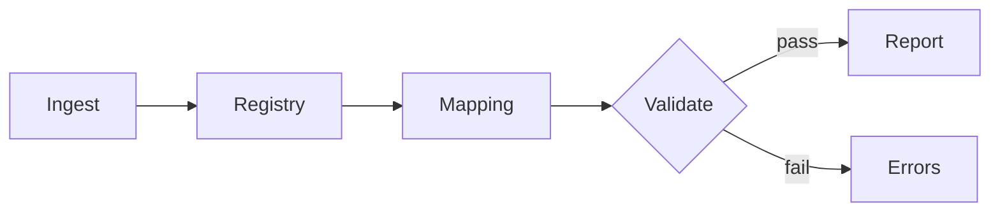

# Orchestration Patterns

## 1) Linear Pipeline
A → B → C → D, used when every step depends on prior outputs.

## 2) Fan-Out / Fan-In
A → {B, C} → D, used when multiple skills can run in parallel after a common ingest.

## 3) Validation Gate
A → B → [Validate] → C, used to block downstream steps on failed checks.

## 4) Optional Branch
A → (B?) → C, used for optional enrichment or post-processing.

## 5) Retry Loop
A → B (fail) → Retry B with fallback inputs.

## Graph Snippets (Mermaid)

